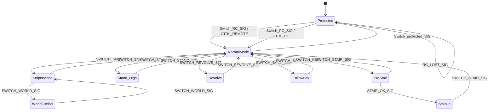

# DecisionAO 状态机

状态机模型源文件为 `qp/qm/decision_ao.qm`，`decision_ao.c/.h` 由 QM 生成，不能手工维护。

当前决策量分成两类：

- 主干状态：通过 `QACTIVE_POST()` 投递 SIG，由 `DecisionAO` 在 AO 上下文中执行状态迁移和 entry/exit。
- 次要状态：由 `StateMachineTask` 根据遥控器或 PC 输入直接修改 `DecisionAO_inst` 字段，不发生状态迁移。

## 主干状态

`Protected` 与 `NormalMode` 是两个顶层兄弟状态，不是父子状态。`SniperMode`、`Stand_High`、`Revolve`、`FollowBck`、`PreStair` 和 `StairUp` 是 `NormalMode` 的子状态，`WorldGimbal` 是 `SniperMode` 的子状态。

### 状态 entry/exit

| 状态 | entry | exit |
|---|---|---|
| `Protected` | `CTRL_STOP`、`CHS_FOLLOW`、`SNIPER_OFF`、`FRIC_OFF`、`STIR_LOCK`、`JOINT_NORMAL`、`STAND_NORMAL`、`MOUSE_FIX_OFF`、`CAM_TARGET_MID`、`WORLD_ENABLE_OFF`、`CAN_DISABLE` | 无 |
| `NormalMode` | `CHS_FOLLOW`、`SNIPER_OFF`、`FRIC_OFF`、`STIR_ANGLE_CONTROL`、`JOINT_NORMAL`、`STAND_NORMAL`、`MOUSE_FIX_OFF`、`CAM_TARGET_MID`、`WORLD_ENABLE_OFF`、`CAN_ENABLE` | 无 |
| `SniperMode` | `SNIPER_ON` | `SNIPER_OFF` |
| `WorldGimbal` | `WORLD_ENABLE_ON` | `WORLD_ENABLE_OFF` |
| `Stand_High` | `STAND_HIGH` | `STAND_NORMAL` |
| `Revolve` | `CHS_REVOLVE` | `CHS_FOLLOW` |
| `FollowBck` | `CHS_FOLLOW_BACK` | `CHS_FOLLOW` |
| `PreStair` | `JOINT_PRESTAIR` | 无 |
| `StairUp` | `JOINT_STAIRUP` | `JOINT_NORMAL` |

### 当前 SIG 投递源

| SIG | 投递条件 | 结果 |
|---|---|---|
| `Switch_protected_SIG` | 左右拨杆同时为上 | 从 `NormalMode` 或其子状态进入 `Protected`；已在 `Protected` 时只消费事件 |
| `Switch_PC_SIG` | 拨杆发生变化，且左中右上 | `Protected -> NormalMode`，或在 `NormalMode` 层将终端改为 `CTRL_PC` |
| `Switch_RC_SIG` | 拨杆发生变化，且不是保护组合或 PC 组合 | `Protected -> NormalMode`，或在 `NormalMode` 层将终端改为 `CTRL_REMOTE` |
| `RC_LOST_SIG` | `remote_source == ERROR_RECEIVE` | 当前仅 `Protected` 处理为自迁移 |
| `SWITCH_SNIPER_SIG` | PC 键盘 `X` 上升沿；非 PC 模式下右拨杆进入或离开下档 | `NormalMode <-> SniperMode` |
| `SWITCH_REVOLVE_SIG` | PC 键盘 `Q` 上升沿 | `NormalMode <-> Revolve` |
| `SWITCH_BACK_SIG` | PC 键盘 `G` 上升沿 | `NormalMode <-> FollowBck` |
| `SWITCH_STAIR_SIG` | PC 键盘 `V` 上升沿 | `NormalMode -> PreStair`，再次触发则退出 `PreStair/StairUp` |
| `STAIR_OK_SIG` | `jointControl` 在 `JOINT_PRESTAIR` 下检测到台阶，单次投递 | `PreStair -> StairUp` |

`SWITCH_STAND_SIG`、`SWITCH_WORLD_SIG` 和 `SwitchR_down_SIG` 已定义在 QM 中，但当前工程没有对应的 `QACTIVE_POST()` 投递入口，因此通过现有遥控器/PC 输入无法触发。

## 次要状态

这些字段不经过 SIG。`StateMachineTask` 每 10 ms 先判断当前是 PC 还是 RC 模式，再从对应的输入源更新：

| 字段 | 输入与修改规则 |
|---|---|
| `fric_mode` | PC 键盘 `F` 上升沿切换；非保护组合下，左拨杆进入上档时切换 |
| `mouse_fix` | PC 键盘 `E` 上升沿在 `MOUSE_FIX_OFF/ON` 间切换 |
| `cam_target` | PC 键盘 `Z` 上升沿按 `MID -> UP -> DOWN -> MID` 循环 |
| `stir_mode` | RC 模式下由左拨杆和摩擦轮状态决定 `ANGLE_CONTROL/LOCK`；PC 模式下鼠标左键在摩擦轮开启且热量余量不少于 100 时设为 `ANGLE_CONTROL`；堵转时最终覆盖为 `STIR_REVERSE` |
| `rc_lost_flag` | 收到 DT7 数据时写 `RC_OK`；接收异常时写 `RC_LOST` |

`can_enable` 不属于直接输入状态。它只由主干状态的 entry 管理：进入 `Protected` 时为 `CAN_DISABLE`，进入 `NormalMode` 时为 `CAN_ENABLE`。

## 每周期处理顺序

`StateMachineTask` 当前按以下顺序处理输入：

1. 左右拨杆同时为上时只投递 `Switch_protected_SIG`，随后立即返回，不再更新次要状态。
2. 根据当前拨杆组合计算本周期的 `is_pc_mode`，不依赖异步 SIG 尚未更新的 `ctrl_terminal`。
3. 拨杆组合发生变化时投递 `Switch_PC_SIG` 或 `Switch_RC_SIG`。
4. PC 模式只处理键盘和鼠标输入，包括主干模式 SIG，以及 `fric_mode`、`mouse_fix`、`cam_target`、`stir_mode`。
5. RC 模式只处理拨杆输入，包括 `fric_mode`、`SWITCH_SNIPER_SIG` 和 `stir_mode`。
6. 两种模式最后都用堵转状态覆盖 `stir_mode`，堵转时强制为 `STIR_REVERSE`。

SIG 由 `DecisionAO` 异步消费；直接字段写入则发生在 `StateMachineTask` 上下文中。

## 当前注意事项

- `NormalMode` 的超状态是 `QHsm_top`，不是 `Protected`。因此 `RC_LOST_SIG` 在 `NormalMode` 及其子状态中会一路冒泡到 `QHsm_top`，当前不会进入 `Protected`。
- `PreStair` 没有 exit。若通过 `SWITCH_STAIR_SIG` 从 `PreStair` 直接返回 `NormalMode`，`joint_mode` 不会由 exit 恢复为 `JOINT_NORMAL`。
- 当前主干状态由 AO 管理，但次要字段仍由 `StateMachineTask` 直接写入，两类写入的执行上下文不同。
